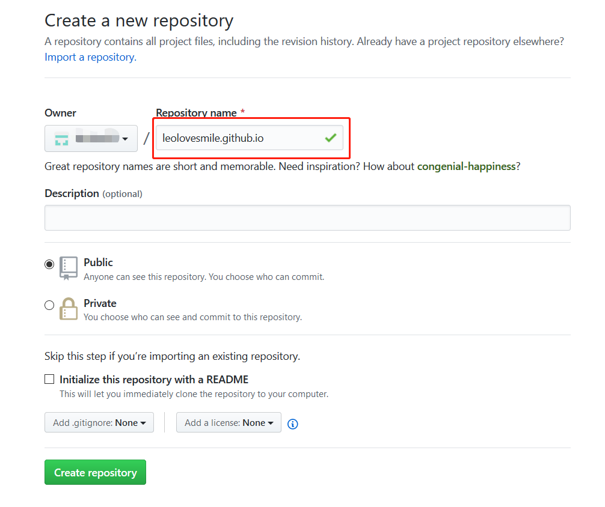
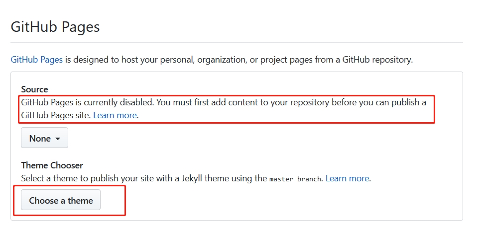
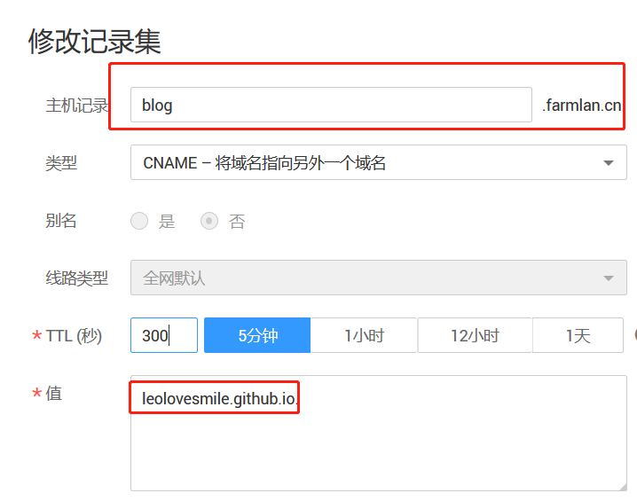

# 使用github pages与docsify搭建个人博客

## 路线的选择
由于我现在基本上文档写作的形式以markdown的形式为主，且利用github来维护，所以自然而然就想到使用github来作为博客背后的repository，而不是考虑使用传统的比较重量级CMS系统，例如wordpress。  
我原本的思路是：

- 创建一个git repository专门来管理博客的markdown原文
- 写文的时候使用markdown工具和git来配合
- 然后网站就写一套纯前端的系统，配合github的api来获取git仓库中的博文、目录等，然后在浏览器端渲染展示，相当于把github当成了blog的后台了  

思路一出来，我觉应该会有成熟的方案不用自己造轮子了，google一下，果然有，那便是github pages了——简直是过于周到了，直接通过简单的配置，便可以帮你把你的git repository变成你的个人博客，甚至还有专属二级域名和ssl证书，而且环境的搭建、系统的维护、文件的存储都不需要你操心，你只需要专心写就行了。并且，这一切都是免费的，我甚至觉得之前自己还专门搞个lvm搭建web服务器有点浪费了，哈哈。

## github pages的申请
github pages的申请和配置过程如下：
- 首先你当然必须有个github的账号，利用这个账号创建一个新的repository，该repository的名称建议写成`username.gitHub.io`的形式，例如我的就是`leolovesmile.github.io`  

- 创建成功之后，点击该repository的*Settings*菜单，在配置页面github pages区域，可以选择你需要使用的分支（如果选*none*，代表不启用github pages）、页面的主题。还需要注意的是如果当前repository没有内容的话，github pages是不被激活的。

- 配置完毕以后，一会儿你的个人博客就可以访问了。在settings页面的github pages区域，可以看到访问链接，通常是形如`[username].github.io`的链接。
- 这时你可以直接在仓库的根目录中创建一个文件`index.md`， 以markdown的形式写一篇个人简历，这样一个外观还不错的在线的个人简历便完成了。

## github pages配置自定义域名
GitHub Pages 从2018年开始提供免费为自定义域名开启 HTTPS 的功能，而且流程非常简单。
- 将自己的域名使用 CNAME 的方式指向自己的 GitHub Pages 域名，也就是在你自己的域名服务商的dns解析中添加一条cname解析记录。  
比如下面是我在我华为云的dns 解析里选择添加子域名 `blog.farmlan.cn` 通过 CNAME 的方式指向我刚刚自定义的 GitHub Pages 域名 `leolovesmile.GitHub.io`。添加完成后等待 DNS 解析的生效（DNS 的解析记录生效到全球可能需要几分钟时间）。

- 然后在github repository 的 Settings 界面，在 GitHub Pages 设置区，填写刚刚建立的子域名，如我刚刚建立的 `blog.farmlan.cn`，然后保存即可。（github会自动在你的repository的根目录创建一个`CNAME`文件，不要删除该文件）
![img](_media/github-pages-custom-domain.png）
- 如果在上面一步你选择了`Enforce https`，等待一段时间（通常证书的颁发可能需要几分钟到一天左右），就会发现你的域名的https生效了。

# docsify的使用

```bash
npm i docsify-cli -g
docsify init ./
docsify serve docs
```